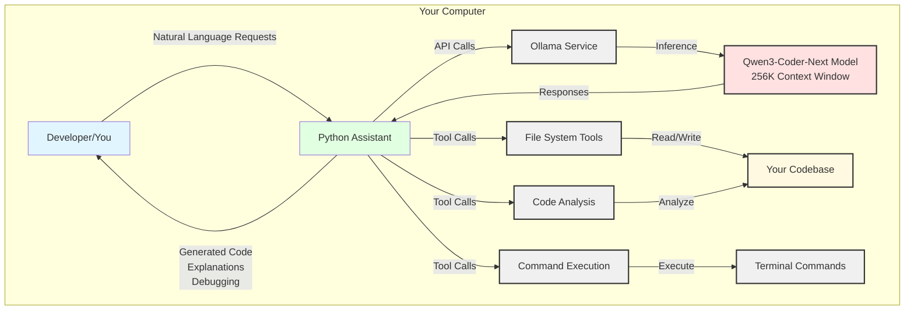
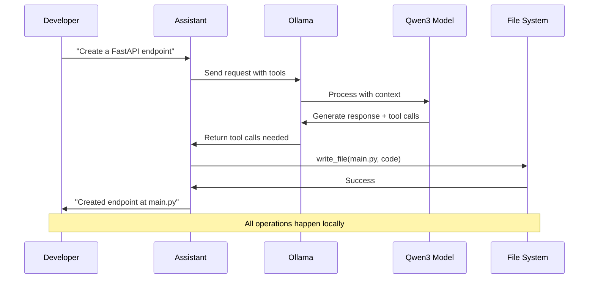

# Architecture Diagram: Local Coding Assistant

This diagram shows how the components interact:

1. **You** interact with the Python Assistant using natural language
2. **Python Assistant** manages conversation and calls tools
3. **Ollama Service** hosts and runs the model locally
4. **Qwen3-Coder-Next** performs the actual AI inference
5. **Tools** (file system, commands, analysis) execute actions
6. **Your Codebase** is accessed and modified locally

**Key Point:** Everything runs on your machine - no cloud services involved!

---

## Data Flow Example



This shows a typical interaction where:
1. You request code generation
2. Assistant communicates with Ollama
3. Model decides to use tools
4. Files are written locally
5. Results are returned to you

---

## System Resource Usage

```
┌─ Typical Resource Usage ─────────────────────────┐
│                                                   │
│  RAM Usage (q4_K_M quantization):                │
│  ▓▓▓▓▓▓▓▓▓▓▓▓▓▓▓▓▓░░░░░░░░  46 GB / 64 GB       │
│                                                   │
│  CPU Usage (during inference):                   │
│  ▓▓▓▓▓▓▓▓░░░░░░░░░░░░░░░░  30-40%               │
│                                                   │
│  Disk Space:                                      │
│  ▓▓▓▓▓▓▓▓▓▓░░░░░░░░░░░░░░  ~52 GB               │
│                                                   │
│  Network: 0 (fully offline)                       │
│                                                   │
└───────────────────────────────────────────────────┘
```